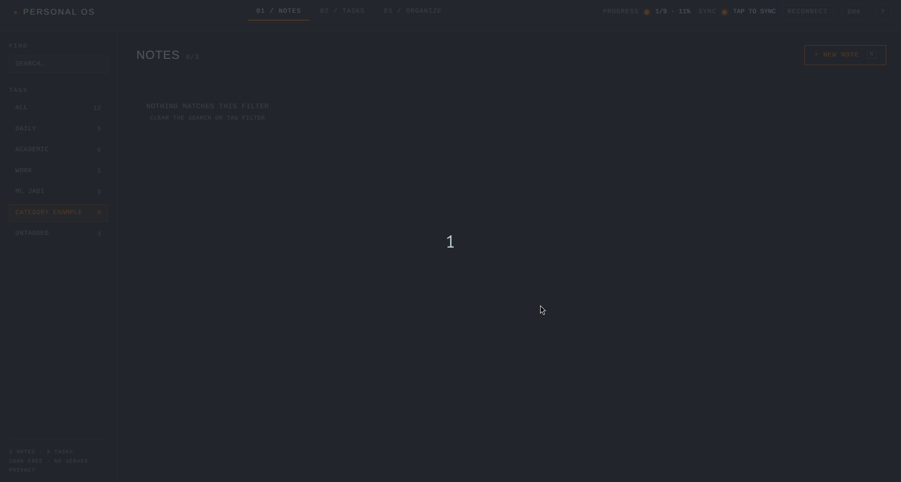

# // PERSONAL_OS(1)_NOTE-TAKER


```text
SYSTEM_STATUS:    OPERATIONAL
SOURCE_OF_TRUTH:  localStorage['personal-os-v1']
SYNC_LAYER:       GOOGLE_DRIVE_APPDATAFOLDER (OPT-IN)
BACKEND:          NONE — THERE IS NO SERVER TO TRUST
PAYLOAD:          5 STATIC FILES · ~29 KB GZIPPED
```

**[ LIVE_SYSTEM ]** → **https://kiarashakbari.github.io/NOTE-TAKER/** ·
[PRIVACY_POLICY](https://kiarashakbari.github.io/NOTE-TAKER/privacy.html)


---

## // 01_SYSTEM_OVERVIEW

**PERSONAL OS** is a notes, task-board, and tag-organizer app that ships as five
static files. No framework. No bundler. No `node_modules`. No account. No
server. Open the page and it works, instantly.

Your data lives in your browser. If you want the same data on your phone, you
tap SIGN IN and it mirrors to a hidden file in **your own** Google Drive. Not a
server we run. There is no server we run.

Once the page is loaded, every interaction is offline — reads and writes hit
`localStorage` synchronously, so nothing waits on a network. (There is no
service worker, so a *cold* load of the hosted URL still fetches the five
files; a local clone needs nothing at all.)

### [ THE_NUMBERS ]

| METRIC | VALUE |
| --- | --- |
| Runtime dependencies | **0** |
| Build / install steps | **0** |
| Backend services | **0** |
| Analytics / telemetry / trackers | **0** |
| Third-party requests before you sign in | **0** |
| Total source (5 files, uncompressed) | **~105 KB** |
| Wire weight of the app itself, gzipped | **~29 KB** |
| Monthly cost to run | **$0** |

### [ CORE_CAPABILITIES ]

> **LOCAL-FIRST BY CONSTRUCTION:** `localStorage` is the source of truth, not a
> cache. Every read and write is synchronous — no spinner, no request, no
> "reconnecting…".
>
> **OPT-IN DRIVE SYNC:** One hidden JSON file in your Drive `appDataFolder`,
> reachable only by this app — invisible in your normal file list.
>
> **ZERO-TRACE UNTIL CONSENT:** Google's sign-in script is injected lazily, only
> at the moment a token is needed. Never sign in, and no third party is ever
> contacted.
>
> **UNDO ON EVERY DESTRUCTIVE ACTION:** Notes, tasks, tags, CLEAR DONE, import,
> and DELETE ALL are all reversible from the toast that follows.
>
> **NO DATA JAIL:** EXPORT BACKUP writes plain JSON straight from the browser.
> Walk away with everything, any time, in one click.
>
> **KEYBOARD-COMPLETE:** Create, search, edit, save, and move tasks between
> columns without touching the mouse.
>
> **FORWARD-COMPATIBLE STATE:** An old browser cannot strip a newer schema's
> fields and push the lossy copy back over your good data.

---

## // 02_ARCHITECTURE_PIPELINE

Load order is load-bearing: `app.js` owns the data, `sync.js` only mirrors it.

```text
[ BROWSER_TAB ]
       |
       v
[ index.html ] — pre-paint theme bootstrap → html[data-theme] (no flash)
       |
       +──> [ app.js ] ................................ OWNS THE DATA
       |       |
       |       |── state  <────────>  localStorage['personal-os-v1']
       |       |── commit(mutate) ──> saveState()
       |       |                        |── stamps state.meta.updatedAt
       |       |                        └── dispatch 'pos:save'
       |       |── render: ACTIVE PANEL ONLY (innerHTML template strings)
       |       |── delegated listeners on static containers (repaint binds 0)
       |       └── window.PersonalOS = { getState, setState, renderAll,
       |                                 toast, confirmAction }
       |
       └──> [ sync.js ] ............................... OPTIONAL MIRROR
               |
               |── on 'pos:save'  ──> debounce 1.5s ──> multipart upload
               |── on load + cached token ──> pull, compare meta.updatedAt
               |── last-write-wins on that single timestamp
               └── Google Drive appDataFolder / personal-os-data.json
                      ^ scope: drive.appdata — nothing else in your Drive
```

### [ INVARIANTS ]

| RULE | WHY IT EXISTS |
| --- | --- |
| `commit()` is the only mutation path | It is what stamps `meta.updatedAt`. A mutation that skips it silently loses the last-write-wins race against Drive. |
| `saveState()` has exactly one caller | Single choke point for persist + repaint + sync signal. |
| `PersonalOS.setState()` does **not** emit `pos:save` | That asymmetry is the only thing preventing a remote → local → remote push loop. It looks like a bug. It is not. |
| Only the active panel repaints | Painting hidden panels wasted most of every repaint and moved focus-bearing DOM out from under open dialogs. |
| Every interpolated value passes `escapeHtml()` / `escapeAttr()` | Full-redraw `innerHTML` rendering with user text in it. |
| `highlight()` matches the **raw** string, escapes per segment | Regexing already-escaped output lets a query like `amp;` split `&amp;` in half. |
| Uploads resolve `remoteFileId` before creating | Otherwise a fresh load that pushes early creates a second data file and the two copies diverge. |
| The multipart boundary is checked against the payload | A note containing the literal boundary would truncate the upload and corrupt the stored file. |
| Token requests happen **only** on a real user click | Silent renewal is unreliable across browsers and can throw up a full login page unprompted. On expiry the app waits for a tap. |

---

## // 03_QUICKSTART

### [ MODE_A: JUST_USE_IT ]

Open **https://kiarashakbari.github.io/NOTE-TAKER/**. That's the whole install.
Nothing to download, no account to create.

### [ MODE_B: RUN_IT_LOCALLY ]

```bash
git clone https://github.com/KiarashAkbari/NOTE-TAKER.git
cd NOTE-TAKER
python3 -m http.server 8000
# open http://localhost:8000
```

Serve it over HTTP rather than double-clicking the file: Google OAuth rejects
`file://` origins, so sync cannot be exercised that way. Notes, tasks, tags,
search, and themes work either way.

There is nothing to install, build, compile, or transpile. If you added a
`package.json`, you'd be the first.

### [ MODE_C: DEPLOY_YOUR_OWN ]

Any static host works, because it *is* static.

```bash
# GitHub Pages: push to a branch, then Settings → Pages → select that branch.
# Netlify / Vercel / Cloudflare Pages: no build command, output dir = repo root.
```

Notes, tasks, and tags work on your fork immediately. To enable **sync** on your
own origin, register your own OAuth client — see `05_SYNC_PROTOCOL`.

### [ VERIFY_A_CHANGE ]

```bash
node --check app.js && node --check sync.js   # the whole "test suite"
```

---

## // 04_OPERATIONAL_MANUAL

Three views, switched by the tabs in the header or by pressing `1` `2` `3`. Below
900px the layout collapses to a single column and the task board stacks, so the
same app works on a phone.

### [ 01 / NOTES ]

Title, body, and tags, with a live `WORDS · CHARS` counter in the editor.
`★ PIN TO TOP` floats a note above the rest; everything else sorts by most
recently touched. Timestamps read as `JUST NOW`, `12M AGO`, `3D AGO`, then fall
back to an absolute date.

### [ 02 / TASKS ]

Three columns — **NOT STARTED**, **IN PROGRESS**, **DONE** — with live counts
and a global `PROGRESS` readout in the header. Move a task in whichever way
suits you:

* **Click** one of the three status dots on the card.
* **Drag** the card into another column.
* **Focus** the card and press `←` / `→`.

`✕ CLEAR DONE` bulk-clears the done column, and appears only when there is
something to clear. It is undoable.

### [ 03 / ORGANIZE ]

Create tags, rename them inline (click the name, `Enter` commits, `Esc` reverts),
and see exactly how many notes and tasks each one carries. Duplicate names are
rejected. Deleting a tag prunes it from every item that referenced it — and is
undoable.

Also the data console: **EXPORT BACKUP** (plain JSON, downloaded locally),
**IMPORT BACKUP**, and **DELETE ALL DATA**, plus a readout of how many bytes
you're actually using.

### [ SEARCH_&_FILTER ]

The rail filters notes and tasks *together*, across title, body, and tag name,
with every match highlighted. Tag chips filter by tag, including an `UNTAGGED`
bucket, and each chip shows its own count.

### [ KEYBOARD_MATRIX ]

| KEY | ACTION |
| --- | --- |
| `1` `2` `3` | Switch view |
| `N` | New note |
| `T` | New task |
| `/` | Focus search |
| `Enter` / `Space` | Open the focused card |
| `←` `→` | Move the focused task between columns |
| `⌘/Ctrl` + `Enter` | Save the open editor |
| `Esc` | Close the top dialog, or clear the search |
| `Tab` | Trapped inside the front-most dialog |

### [ SAFETY_BEHAVIOURS ]

These are the details that decide whether you trust an app with your notes.

* **No `window.confirm`.** Destructive actions open a themed, focus-trapped
  dialog that spells out exactly what will happen and focuses CANCEL — so a
  stray `Enter` destroys nothing.
* **Undo restores the minimum.** Deleted items are spliced back at their
  original indices, so edits you made while the toast was still up survive.
* **Typed text is never lost.** If the item you're editing vanishes mid-edit
  (another tab, or a Drive pull), saving re-creates it under its original id and
  tells you so.
* **Refresh protection.** Closing the tab with a dirty editor prompts first.
* **Cross-tab coherence.** A second tab's changes are adopted instead of
  silently overwriting yours.
* **Blocked storage is announced,** not swallowed: private mode tells you up
  front that nothing will persist.
* **Themes** are dark / light / follow-system, resolved *before* first paint.
  Both palettes are contrast-checked — brand `#FF6600` measures 2.65:1 on the
  light background, so light mode uses `#A83C00` instead.

---

## // 05_SYNC_PROTOCOL

Sync is entirely optional and off until you tap SIGN IN. What it does:

1. Requests one OAuth scope: **`drive.appdata`**. That grants access to this
   app's own hidden folder and **nothing else** — not your files, not Gmail, not
   contacts.
2. Reads/writes a single file, `personal-os-data.json`, in your Drive
   `appDataFolder`. It never appears in your normal Drive listing.
3. On load with a still-valid cached token, it pulls and compares
   `meta.updatedAt`. Newer side wins.
4. On every local change, it debounces 1.5s and pushes. A pending push is
   flushed on `pagehide` so navigating away doesn't drop it.
5. If a sync fails and the connection later returns, it retries by itself —
   reusing the token it already has, with no click and no Google auth call.
6. On expiry it stops and waits for a tap. It will never ambush you with a login
   screen.

### [ STATUS_READOUT ]

| INDICATOR | MEANING |
| --- | --- |
| `OFF` | Sync is off. Data stays in this browser. |
| `SYNCING…` | Talking to Google Drive. |
| `SYNCED` | Mirrored to your Drive app folder. |
| `ERROR` | Sync failed. Local data is safe. |
| `TAP TO SYNC` | Session expired — one tap reconnects. |

### [ ENABLING_SYNC_ON_YOUR_OWN_FORK ]

The shipped client id is registered for the published GitHub Pages origin only,
so on your own domain you must register your own:

1. [Google Cloud Console](https://console.cloud.google.com/) → create a project.
2. **APIs & Services → Library** → enable **Google Drive API**.
3. **OAuth consent screen** → External. Add the `.../auth/drive.appdata` scope
   and a privacy policy URL — point it at your deployed `privacy.html`.
4. **Credentials → Create OAuth client ID → Web application.** Add your
   authorized JavaScript origins, e.g. `https://<you>.github.io` and
   `http://localhost:8000`.
5. Paste the client id into `GOOGLE_CLIENT_ID` at the top of `sync.js`.

No client secret, no redirect URI, no backend. The browser holds a short-lived
access token and talks to Drive REST directly.

---

## // 06_FILE_STRUCTURE

```text
/ROOT
├── index.html      # [SHELL]   Markup, dialogs, pre-paint theme bootstrap
├── app.js          # [KERNEL]  State, rendering, interaction. Owns localStorage
├── sync.js         # [MIRROR]  Optional Drive layer. Loads AFTER app.js
├── style.css       # [TOKENS]  Both theme palettes + every component
├── privacy.html    # [LEGAL]   Required by the OAuth consent screen
├── AGENTS.md       # Contributor + AI-agent contract (read before editing)
└── README.md       # This document
```

That is the entire application: the first five entries. The last two are
documentation. There is no `dist/`, no `node_modules/`, no lockfile, no config.

---

## // 07_DESIGN_CONSTRAINTS

Ground rules for anyone (or anything) sending a patch. Full detail lives in
[`AGENTS.md`](AGENTS.md).

| CONSTRAINT | RATIONALE |
| --- | --- |
| **No npm, no framework, no bundler, no CDN** | Beyond Google's own auth script, nothing is fetched. That promise is the product. |
| **Free and serverless, permanently** | No backend, no analytics, no paid tier, no runtime dependency. |
| **All external state goes through `sanitizeState()`** | It coerces types, regenerates missing ids, prunes dangling tag refs, and preserves unknown fields plus a higher `version`. Extend `KNOWN_ITEM_FIELDS` when you add a field. |
| **Colors come only from the per-theme tokens** | Both theme blocks must define the identical token set. Never dim small text with `opacity` — 10px labels at 70% measure ~3:1. |
| **`privacy.html` makes concrete claims** | If data handling changes, that file changes with it. |
| **`app.js` and `sync.js` share one lexical scope** | A top-level `const` declared in both is a `SyntaxError` that silently kills sync. |

---

## // 08_PRIVACY_LEDGER

```text
>> DATA_AT_REST:        YOUR BROWSER (+ YOUR OWN DRIVE, IF YOU OPT IN)
>> DATA_SENT_TO_DEV:    NONE — THERE IS NOWHERE TO SEND IT
>> ANALYTICS:           NONE
>> COOKIES:             NONE
>> THIRD_PARTIES:       GOOGLE, ONLY AFTER YOU TAP SIGN IN
>> OAUTH_SCOPE:         drive.appdata (THIS APP'S HIDDEN FOLDER ONLY)
>> EXPORT:              PLAIN JSON, ONE CLICK, LOCAL
>> DELETE:              IN-APP, OR REVOKE ACCESS AT
                        myaccount.google.com/permissions
```

Full text: [`privacy.html`](privacy.html).

---

## // 09_ENGINEER_INFO

```text
LEAD_ENGINEER:    KIARASH AKBARI
PROJECT:          PERSONAL_OS // NOTE-TAKER
STACK:            HTML + CSS + JS. THAT IS THE COMPLETE LIST.
SOURCE:           github.com/KiarashAkbari/NOTE-TAKER
CONTACT:          consistentrash@gmail.com
```

Branch layout: work lands on `v2`; `main` is what GitHub Pages publishes.

---

## // 10_LICENSE_AND_LIABILITY

```text
>> LICENSE_TYPE:        GNU GPLv3 (COPYLEFT)
>> CLOSED_SOURCE_USE:   PROHIBITED
>> SOURCE_DISCLOSURE:   MANDATORY
```

**[ NOTICE_OF_NON_LIABILITY ]**

1. **NO WARRANTIES.** Provided "as is", without warranty of any kind, express or
   implied.
2. **YOUR DATA IS YOUR RESPONSIBILITY.** Browser storage can be cleared by the
   browser, by private mode, or by you. Use **EXPORT BACKUP**. The author
   accepts no liability for lost notes.
3. **NO PROFESSIONAL RELIANCE.** This is a personal organizer, not a system of
   record for anything that matters legally, medically, or financially.

*System Halt.*
